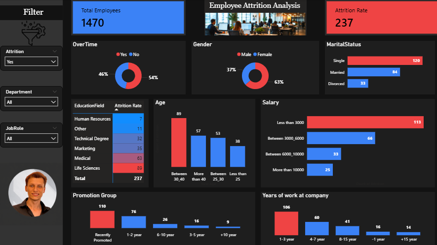
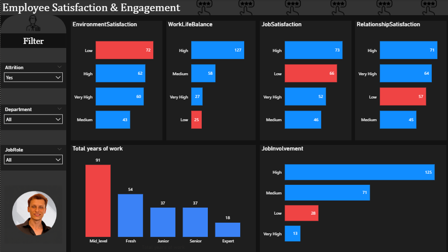

# Attrition-analyst
data analysis project using power bi to explore company attrition 
## Data source :
from kaggel 
## Tools used :
power bi using Power_Query and dax 
## Project Question : 
What factors influence employee attrition in the company ??
## Explore data :
the data contains 1471 rows and 33 columns 
## Clean data :
1. Removed columns that were not relevant to the analysis objectives.

2. Removed duplicate records, where applicable.

3. Validated the dataset for accuracy and corrected any data inconsistencies.

4. Transformed numerical data into meaningful categorical labels to simplify the analysis and improve the readability and interpretation of the results.

5. The dataset is now clean and ready for analysis.
## data analysis :
                                                  Dashboard1
                      

Employee Attrition Analysis Insights

Employee Overview

- The company has a total workforce of 1,470 employees.
- A total of 237 employees left the company, highlighting the need to identify the main factors contributing to employee turnover.

Overtime Analysis

- 54% of employees who left the company worked overtime, while 46% did not.
- This suggests that overtime may have a significant impact on employee attrition and work-life balance.

Attrition by Gender

- Male employees accounted for 63% of total attrition.
- Female employees represented 37% of employees who left the company.
- The higher attrition among male employees indicates the need for further investigation into role-specific or department-specific turnover.

Attrition by Marital Status

- Single employees recorded the highest attrition with 120 employees.
- Married employees accounted for 84 resignations.
- Divorced employees recorded 33 resignations.
- These findings suggest that single employees are more likely to leave the organization than other marital groups.

Attrition by Education Field

- Employees from Life Sciences recorded the highest attrition, followed by Medical, Marketing, Technical Degree, Other, and Human Resources.
- This analysis helps identify educational backgrounds that may require stronger retention strategies.

Attrition by Age Group

- Employees aged 30–40 years recorded the highest attrition with 89 employees.
- Employees aged over 40 years accounted for 57 resignations.
- Employees aged 25–30 years recorded 53 resignations.
- Employees under 25 years had the lowest attrition with 38 resignations.
- These results indicate that mid-career professionals are the most likely to leave the company.

Attrition by Salary

- Employees earning less than $3,000 experienced the highest attrition with 113 employees.
- Employees earning $3,000–$6,000 recorded 66 resignations.
- Employees earning $6,000–$10,000 accounted for 33 resignations.
- Employees earning more than $10,000 had the lowest attrition with 25 resignations.
- The analysis suggests a strong relationship between lower salaries and higher employee turnover.

Attrition by Promotion History

- Employees who had never been promoted recorded the highest attrition with 110 employees.
- Employees promoted within 1–2 years accounted for 76 resignations.
- Attrition decreased significantly among employees with longer promotion intervals.
- Career growth and promotion opportunities appear to play an important role in employee retention.

Attrition by Years at Company

- Employees with 1–3 years of service recorded the highest attrition with 106 employees.
- Employees with 4–7 years accounted for 60 resignations.
- Employees with 8–15 years recorded 41 resignations.
- Employees with less than 1 year and more than 15 years experienced the lowest attrition.
- The results suggest that employee retention efforts should focus on the first few years of employment.

Business Recommendations

- Reduce excessive overtime to improve employee work-life balance.
- Review salary structures for lower-income employees to improve retention.
- Provide clear career development and promotion opportunities.
- Strengthen employee engagement programs during the first three years of employment.
- Conduct regular exit interviews to identify the primary causes of employee attrition and support data-driven HR decisions.
- 
                                                    Dashboard2
                      

Employee Satisfaction Overview

- The dashboard evaluates employee satisfaction across multiple dimensions, including work-life balance, job satisfaction, relationship satisfaction, environment satisfaction, job involvement, and career level.
- These insights help identify the key factors that influence employee engagement and retention.

Environment Satisfaction

- Employees with Low Environment Satisfaction recorded the highest attrition (72 employees).
- Employees reporting High and Very High satisfaction experienced lower attrition, with 62 and 60 employees, respectively.
- These findings suggest that improving the workplace environment may help reduce employee turnover.

Work-Life Balance

- Employees reporting High Work-Life Balance accounted for the largest group (127 employees).
- Medium work-life balance included 58 employees, followed by Very High (27) and Low (25).
- The results indicate that maintaining a healthy work-life balance plays an important role in employee engagement and retention.

Job Satisfaction

- Employees with High Job Satisfaction represented the largest group (73 employees).
- Employees with Low Job Satisfaction accounted for 66 employees, followed by Very High (52) and Medium (46).
- Although many employees reported high satisfaction, reducing the number of employees with low job satisfaction remains an important objective.

Relationship Satisfaction

- High Relationship Satisfaction recorded the largest group with 71 employees.
- Very High satisfaction followed with 64 employees.
- Low and Medium satisfaction accounted for 57 and 45 employees, respectively.
- Positive workplace relationships appear to contribute to stronger employee engagement.

Employee Distribution by Career Level

- Mid-Level employees represented the largest group with 91 employees.
- Fresh employees accounted for 54 employees.
- Junior and Senior employees each recorded 37 employees.
- Expert-level employees represented the smallest group with 18 employees.
- The workforce is primarily concentrated in mid-level positions, indicating opportunities to strengthen long-term career development.

Job Involvement

- High Job Involvement was the most common level, representing 125 employees.
- Medium Job Involvement accounted for 71 employees.
- Low and Very High involvement recorded 28 and 13 employees, respectively.
- The results suggest that most employees remain actively engaged in their work despite the observed attrition.

Business Recommendations

- Improve the working environment by addressing factors that reduce employee satisfaction.
- Continue supporting work-life balance initiatives to maintain employee engagement.
- Monitor employees reporting low job or relationship satisfaction and provide targeted support.
- Develop career growth opportunities for mid-level employees to encourage long-term retention.
- Conduct regular employee engagement surveys to identify satisfaction trends and address issues before they lead to turnover.
